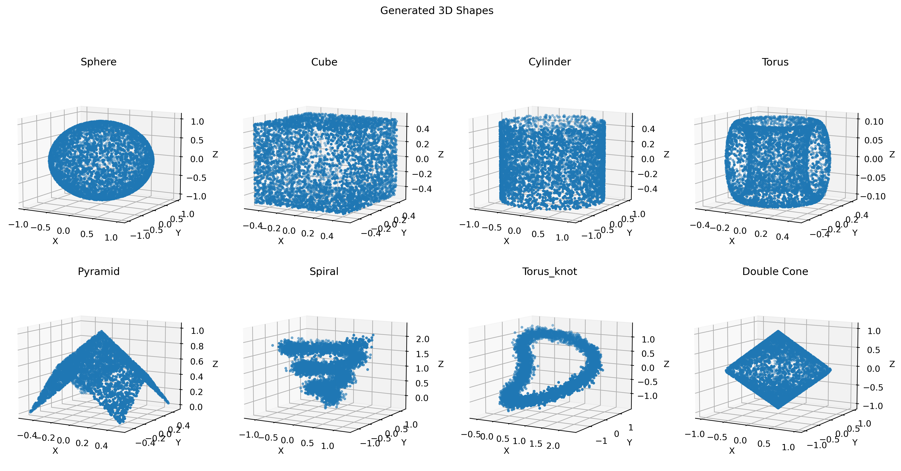
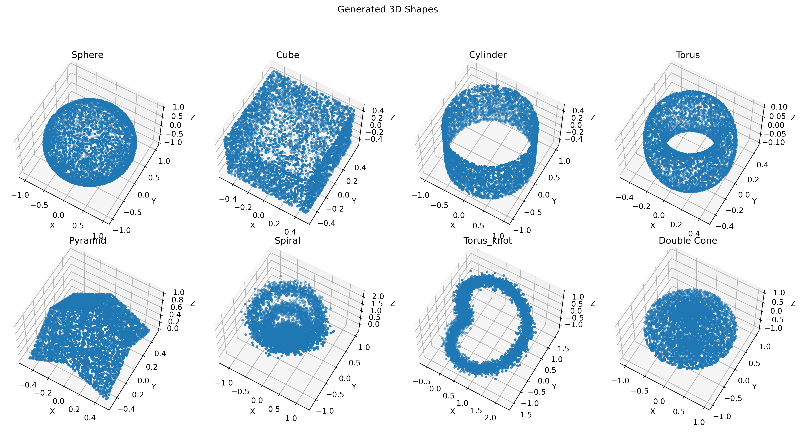
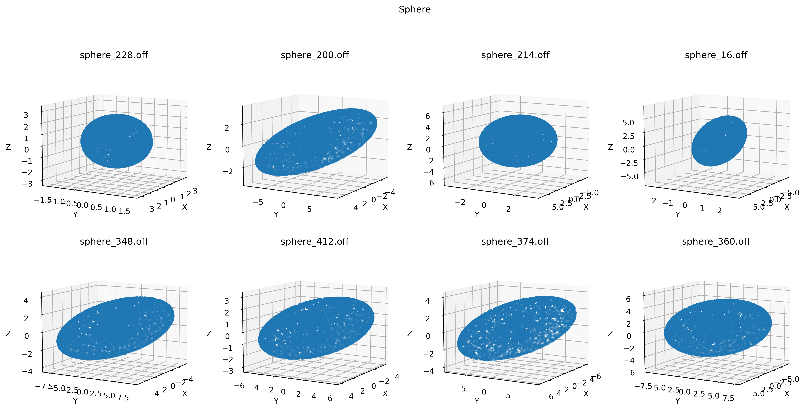
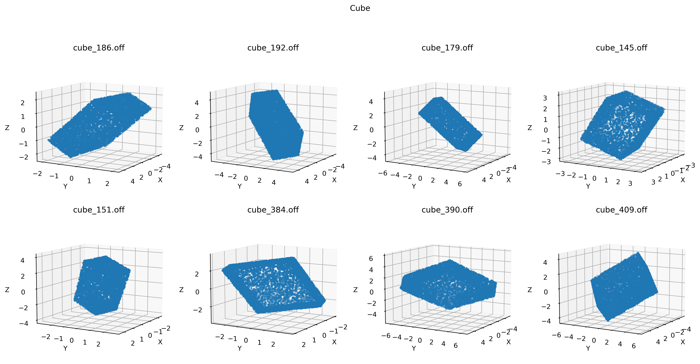
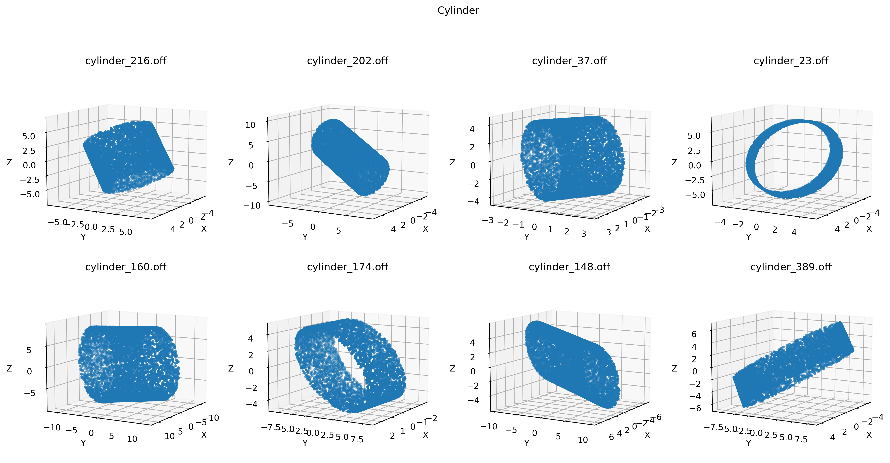
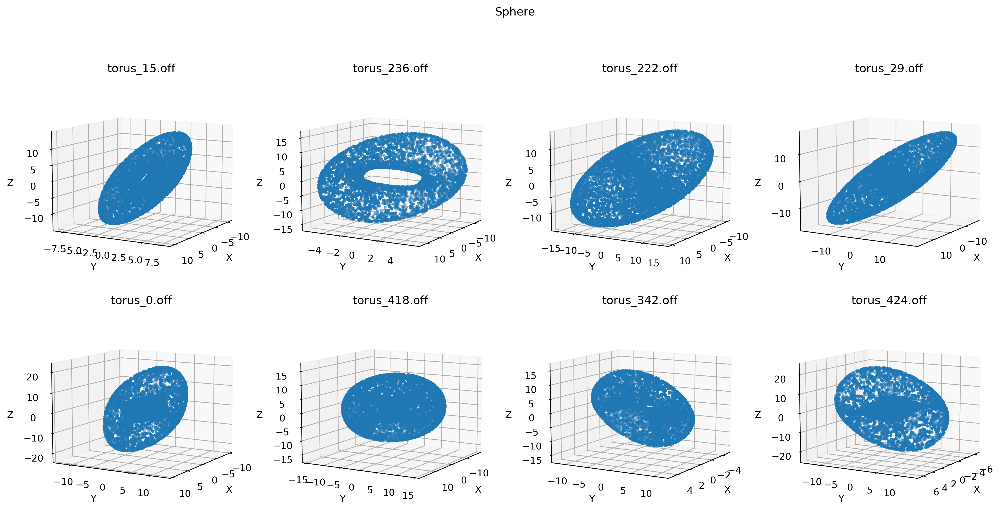
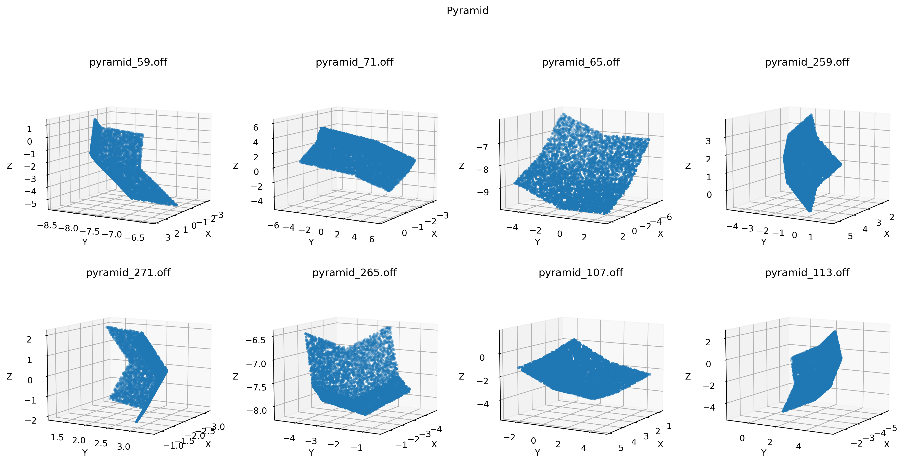
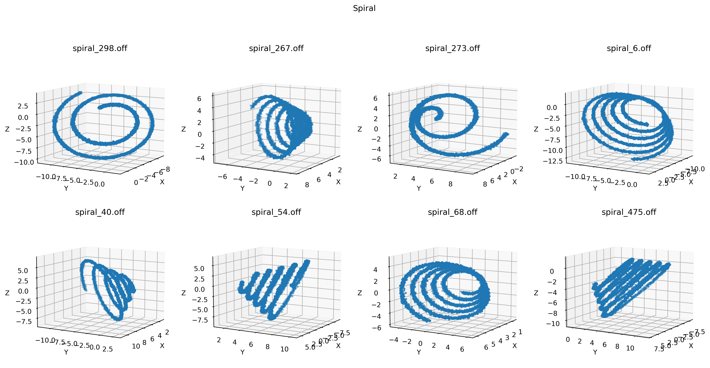
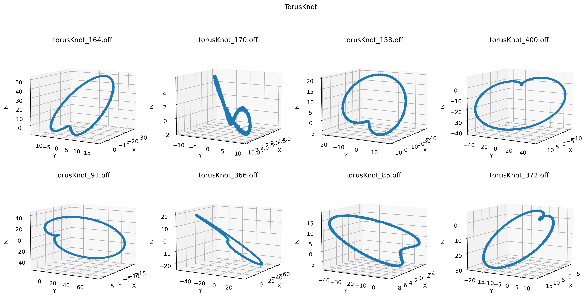

# Point-Cloud-Classification-with-Customized-Dataset
Classify 3D geometry shapes (point clouds) with self-generated dataset. This is Junyu Liu's chosen starter project for Brown Vision Comuting (BVC) onboard.

## Dataset Creation

The general idea for creating this dataset is to utilize parametric functions that resembles geometric shapes and create surface point clouds accordingly. The dataset generation code can be found in ```generation/generateShapes.ipynb```, and the visualization code can be found in ```generation/visualizer.ipynb```. Some sample point clouds can be found in ```samples/```.

### Overview

There are 8 classes of shapes in this dataset, which are sphere, cube, cyliner, torus, pyramid, spiral, torus knot, and double cone. The whole dataset contains 700 point clouds for each class, in which 500 points clouds are used for training and the rest 200 points clouds are used for testing.

An overview demonstarion of these shapes is shown below, followed by more detailed demonstrations of the variations and parameter settings of each class.

Here is a demonstration of the 8 classes of shapes at elevation angle 10 degrees.

And here is a demonstration of the 8 classes of shapes at elevation angle 60 degrees.


### Class-by-class demonstration
This is a detailed explanation of how each class of shapes are generated, including the generation procedure and ajustable parameter settings. The number of points for each point cloud is randomly sampled from [4000, 8000]. All point clouds are randomly rotated in 3D (along x, y, and z axis) after being generated from the corresponding functions. The rotation angle along each axis is randomly sampled from [0, 2\(\pi\)].

#### Sephere
The sephere shape is generated by sampling points on a spherical surface and stretching into shapes with elliptic sections, where the the major and minor axes of the ellipse section are adjustable. In the dataset, these values are ramdonly selected from [1.0, 10.0].


#### Cuboid
The cuboid shape is generated by sampling points on a cube surface where the length, width, and height are adjustable. In the dataset,these values are ramdonly selected from [1.0, 10.0].


#### Cylinder
The cylinder shape is generated by sampling the x and y coordinates on a ellipse and z coordinates on the height of the Cylinder. In the dataset, the major and minor axes of the ellipse section and the height are randomly selected from [1.0, 10.0].


#### Torus
The torus shape is generated by sampling the x and y coordinates according to major radius and minor radius of two ellipse sections, and sampling the z coordinates on a circle (with the diameter be the difference of major and minor radius). The major radius and minor radius are ransomly selected from [7.0, 10.0] and [2.0, 5.0] respectivelt, and the ellipse factor (controls the ellipse shape) is selected from [2, 5].


#### Pyramid
The pyramid shape is generated by sampling the x and y coordinates from a rectangle area centered on (0, 0) and calculate z coordiante by subtracting the sum of absolute value of x and y from the height. The length and width of the rectangle areas, and the height are randomly sampled for [2.0, 10.0].


#### Spiral
The spiral shape is generated by sampling the x and y coordinates along progressively spreading circle-like curves, where the number of turns decides the circling numbers and the starting and ending radius decide the spreading rate. The z coordinate is sampled from the height of the spiral. The number of turns is randomly sampled from [2, 5], while the staring and ending radius are randomly sampled from [1.0, 4.0] and [5.0, 10.0] respectively. The staring and ending height are randomly sampled from [1.0, 4.0] and [5.0, 10.0] respectively.


#### Torus Knot
The torus shape is generated by samppling the x, y, and z coordinates along prograssively shifting parametric fucntions (more details could be found in code). The stretching factor for x, y, and z are randomly sampled from [1.0, 5.0].


#### Double Cone
The double cone shape is generated by sampling the x and y coordinates on the clamped area by 2 ellipses and sampling z coordinates from [-height, height]. The base major radius and minor radius are randomly sampled from [5.0, 10.0], while the top major radius and minor radius are randomly sampled from [1.0, 4.0]. The height is randomly sampled from [1.0, 4.0].


## Training with Classification Models

### Tarining settings

The classification model I used is [PointNet](https://arxiv.org/abs/1612.00593). The code in ```trainCode/modification/``` (note that only the modifed files are put in it) is based on a [pytorch implementation](https://github.com/fxia22/pointnet.pytorch) of PoinNet. The generated dataset follows the standard pytorch Dataloader requirements with similar dataset structure as [ModelNet40](https://modelnet.cs.princeton.edu/), and the dataset operation code can be found in ```trainCode/dataOperator.ipynb```. The code to run training can be found in ```trainCode/PointNetPyTorch.ipynb```.

The training is done on Google Colab using T4 GPU. The ```batchsize``` is set to 128 and the ```epoch number``` is set to 20.


### Result

The test accuracy is **98.625\%** on 1600 test point clouds for 8 classes.

When checking the validation accuracy during the training process, the highest ones are 98.625\% when approaching the end of the training process.

The trained models (saved for each epoch) can be found in ```trainCode/trained_model/```. The final model is ```cls_model_19.pth```.
