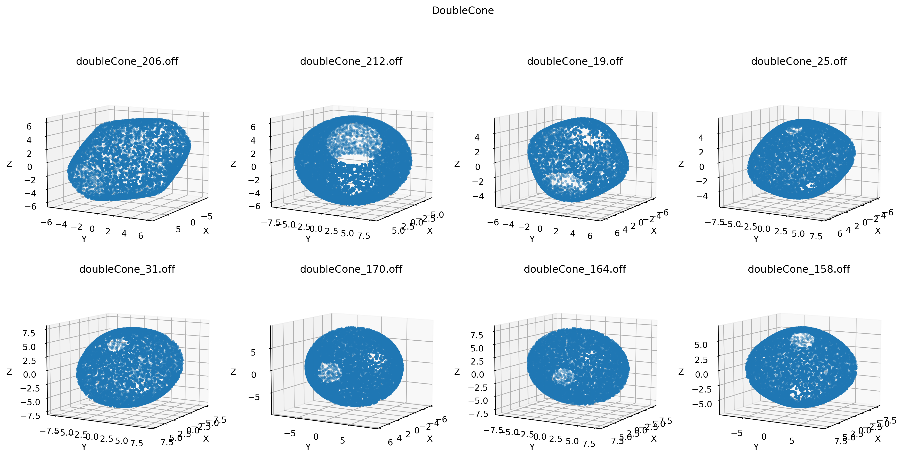

# Point-Cloud-Classification-with-Customized-Dataset
Classify 3D point clouds with self-generated dataset. Brown Vision Comuting (BVC) starter project for onboard.

## Dataset Creation

### Overview

Here are how these 8 classes of shapes look like at elevation angle 10.

And here are how these 8 classes of shapes look like at elevation angle 60.

### Class-by-class demonstration

#### Sephere

#### Cuboid

#### Cylinder

#### Torus

#### Pyramid

#### Spiral

#### Torus Knot

#### Double Cone

